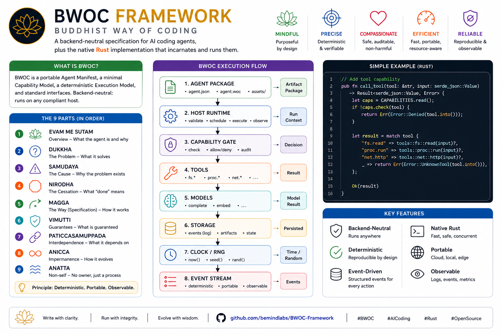

# BWOC Framework — Buddhist Way of Coding

A framework for building AI coding agents grounded in Buddhist philosophy as an engineering discipline.

[](https://github.com/bemindlabs/BWOC-Framework/stargazers)
[](LICENSE)
[](https://www.rust-lang.org/)
[](#tech-stack)
[](modules/agent-template/docs/)
[](#status)
[](CONTRIBUTING.md)

Buddhist principles are used here as **engineering thinking aids** — not religious interpretation. Pali terms are section names; the content is technical.

> GitHub: [github.com/bemindlabs/BWOC-Framework](https://github.com/bemindlabs/BWOC-Framework) · Conceptual core: [`PHILOSOPHY.en.md`](modules/agent-template/docs/en/PHILOSOPHY.en.md) · Vision: [`VISION.md`](VISION.md) · Contributing: [`CONTRIBUTING.md`](CONTRIBUTING.md)



---

## Contents

- [BWOC Framework — Buddhist Way of Coding](#bwoc-framework--buddhist-way-of-coding)
  - [Contents](#contents)
  - [What It Is](#what-it-is)
  - [Why Buddhist Frameworks](#why-buddhist-frameworks)
  - [The 22 Frameworks](#the-22-frameworks)
    - [A — Process](#a--process)
    - [B — State](#b--state)
    - [C — Growth](#c--growth)
    - [D — Relational](#d--relational)
    - [E — Discipline](#e--discipline)
    - [F — Governance](#f--governance)
  - [Stack Diagram](#stack-diagram)
  - [Five Principles to Know First](#five-principles-to-know-first)
    - [1. Yoniso Manasikāra — Verify Before Act](#1-yoniso-manasikāra--verify-before-act)
    - [2. Mattaññutā — Right Amount](#2-mattaññutā--right-amount)
    - [3. Anattā — Non-Clinging](#3-anattā--non-clinging)
    - [4. Samānattatā — Equal Treatment](#4-samānattatā--equal-treatment)
    - [5. Sīla-sāmaññatā — Communal Convention](#5-sīla-sāmaññatā--communal-convention)
  - [Repository \& Workspace Layout](#repository--workspace-layout)
    - [A. The BWOC framework repository](#a-the-bwoc-framework-repository)
    - [B. A user workspace (what `bwoc init` creates)](#b-a-user-workspace-what-bwoc-init-creates)
  - [Getting Started](#getting-started)
    - [Install the toolkit](#install-the-toolkit)
    - [As an Agent Author](#as-an-agent-author)
    - [Reading Paths](#reading-paths)
  - [Security Rules (Sīla 5)](#security-rules-sīla-5)
  - [FAQ](#faq)
  - [Tech Stack](#tech-stack)
  - [Status](#status)
  - [Contributing](#contributing)
  - [Security](#security)
  - [Code of Conduct](#code-of-conduct)
  - [License](#license)

---

## What It Is

BWOC provides a **template and doctrine** for creating AI coding agents with a consistent, principled foundation:

- **One repo, one agent** — each agent lives in its own repository cloned from the template
- **Backend-neutral** — runs on Claude, Antigravity, Codex, Kimi, or self-hosted models via `bwoc-harness` (`bwoc spawn --backend ollama`; Ollama / any OpenAI-compatible endpoint)
- **Persistent memory** — accumulates knowledge across sessions with impermanence-aware pruning
- **Multi-agent safe** — multiple agents co-operate in the same repo without collision

---

## Why Buddhist Frameworks

Buddhist thinking addresses areas where Western engineering frameworks (DDD, Clean Architecture, SOLID) are thin: **state impermanence, failure tracing, lifecycle, inter-agent trust, and threat modeling**.

| Engineering Problem     | Buddhist Framework                                  |
| ----------------------- | --------------------------------------------------- |
| Problem solving         | Ariyasacca 4 (Four Noble Truths)                    |
| Functional requirements | Magga 8 (Noble Eightfold Path)                      |
| System architecture     | Khandha 5 (Five Aggregates)                         |
| State & impermanence    | Tilakkhaṇa (Three Marks)                            |
| Failure analysis        | Paṭiccasamuppāda (Dependent Origination)            |
| Audit logging           | Kamma 3 (Three Doors of Action)                     |
| Observability           | Satipaṭṭhāna 4 (Four Foundations)                   |
| Agent lifecycle         | Bhāvanā 4 (Four Cultivations)                       |
| Self-improvement        | Paññā 3 (Three Roots of Wisdom)                     |
| Capability maturity     | Ariya-dhana 7 (Seven Noble Treasures)               |
| Error UX                | Brahmavihāra 4 (Four Divine Abidings)               |
| Inter-agent trust       | Kalyāṇamitta 7 (Seven Qualities of a Good Friend)   |
| Threat modeling         | Taṇhā 3 (Three Cravings)                            |
| Baseline security       | Sīla 5 (Five Precepts)                              |
| Fleet governance        | Aparihāniya-dhamma 7 (Seven Non-Decline Principles) |

---

## The 22 Frameworks

Organized into six groups — see [`PHILOSOPHY.en.md`](modules/agent-template/docs/en/PHILOSOPHY.en.md) for full mappings.

### A — Process

Ariyasacca 4 · Magga 8 · Khandha 5

### B — State

Tilakkhaṇa · Paṭiccasamuppāda · Kamma 3

### C — Growth

Iddhipāda 4 · Bhāvanā 4 · Paññā 3 · Ariya-dhana 7

### D — Relational

Sappurisadhamma 7 · Saṅgahavatthu 4 · Sāraṇīyadhamma 6 · Brahmavihāra 4 · Kalyāṇamitta 7

### E — Discipline

Yoniso Manasikāra · Acinteyya 4 · Satipaṭṭhāna 4 · Padhāna 4

### F — Governance

Aparihāniya-dhamma 7 · Taṇhā 3 · Sīla 5

---

## Stack Diagram

```
┌──────────────────────────────────────────────────────┐
│  Aparihāniya-dhamma (Fleet Governance)               │ ← Org level
├──────────────────────────────────────────────────────┤
│  Taṇhā 3 (Threat Model) + Sīla 5 (Baseline)          │ ← Security
├──────────────────────────────────────────────────────┤
│  Bhāvanā 4 (Lifecycle) + Paññā 3 (Improvement)       │ ← Agent growth
├──────────────────────────────────────────────────────┤
│  Sāraṇīyadhamma + Kalyāṇamitta (Inter-agent)         │ ← Interconnect
├──────────────────────────────────────────────────────┤
│  Saṅgahavatthu + Brahmavihāra (UX)                   │ ← User layer
├──────────────────────────────────────────────────────┤
│  Magga 8 (Functional requirements)                   │ ← SRS
├──────────────────────────────────────────────────────┤
│  Khandha 5 (Architecture)                            │ ← Components
├──────────────────────────────────────────────────────┤
│  Satipaṭṭhāna 4 (Observability)                      │ ← Cross-cutting
├──────────────────────────────────────────────────────┤
│  Iddhipāda 4 (Engine of work)                        │ ← Runtime
├──────────────────────────────────────────────────────┤
│  Tilakkhaṇa + Kamma 3 (State & Audit)                │ ← Foundation
├──────────────────────────────────────────────────────┤
│  Paṭiccasamuppāda (Failure analysis)                 │ ← When broken
├──────────────────────────────────────────────────────┤
│  Yoniso manasikāra + Acinteyya (Method)              │ ← Thinking
└──────────────────────────────────────────────────────┘
       Ariyasacca 4 (Problem-solving cycle, end-to-end)
       Sappurisadhamma 7 (Context sensing, end-to-end)
```

---

## Five Principles to Know First

### 1. Yoniso Manasikāra — Verify Before Act

Memory is a past claim. Verify against present state before acting on it.

### 2. Mattaññutā — Right Amount

`MEMORY.md` ≤ 200 lines. Forces selection of what actually matters.

### 3. Anattā — Non-Clinging

Task done → cleanup worktree → delete branch. No attachment to past state.

### 4. Samānattatā — Equal Treatment

All backends receive equal treatment. No vendor favoritism in tooling.

### 5. Sīla-sāmaññatā — Communal Convention

All agents run under the same rules via `conventions.md` and a neutrality check.

---

## Repository & Workspace Layout

Two distinct trees the project deals with: **(A)** this repository — what a contributor clones; and **(B)** a _user workspace_ — what `bwoc init` creates on a user's machine. They are not the same thing.

### A. The BWOC framework repository

```
bwoc-framwork/
├── crates/                      ← Rust workspace (the reference implementation)
│   ├── bwoc-cli/                  • `bwoc` binary — install + workspace + lifecycle
│   ├── bwoc-agent/                • `bwoc-agent` daemon — control socket + inbox
│   └── bwoc-core/                 • shared types — manifest, workspace, identity
├── modules/
│   └── agent-template/          ← Core template (cloned per agent — see B)
│       ├── AGENTS.md              • single source of truth (symlinked from CLAUDE/AGY/CODEX/KIMI/OLLAMA.md)
│       ├── docs/{en,th}/          • PHILOSOPHY · PRD · SRS · SELF-IMPROVEMENT · THREAT-MODEL · OVERVIEW
│       ├── persona/ · mindsets/ · skills/ · interconnect/ · memories/
│       └── scripts/               • incarnate.sh · check-agent-neutrality.sh
├── docs/{en,th}/                ← Framework-level docs (bilingual pair)
│                                    ARCHITECTURE · INCARNATION · WORKSPACE · NAMING · GLOSSARY · ROADMAP · FAQ
├── examples/                    ← howto · showcases · usecases (illustrative)
├── applications/                ← Phase 4 placeholder — reference agents land here
├── scripts/                     ← install.sh · bump-version.sh
├── notes/                       ← Development logs — YYYY-MM-DD_<title>.md
├── .github/                     ← CI (ci.yml, docs.yml) · issue + PR templates
├── Cargo.toml · Cargo.lock      ← Cargo workspace root
└── README · VISION · VERSION · CHANGELOG · CONTRIBUTING · SECURITY · CODE_OF_CONDUCT · LICENSE · CLAUDE.md
```

### B. A user workspace (what `bwoc init` creates)

The CLI operates against a **workspace** the user designates — independent of any git repository. Full spec in [`docs/en/WORKSPACE.en.md`](docs/en/WORKSPACE.en.md) (Thai: [`docs/th/WORKSPACE.th.md`](docs/th/WORKSPACE.th.md)).

```
<workspace>/                    ← any directory the user picks
├── .bwoc/                        • workspace marker (REQUIRED)
│   ├── workspace.toml              · name, version, defaults (backend, lang)
│   ├── agents.toml                 · auto-maintained agent index
│   └── memory/                     · workspace-scoped memory (OPTIONAL)
├── agents/                       • incarnated agents live here (RECOMMENDED)
│   ├── alpha/                      · one BWOC agent — clone of `modules/agent-template/`
│   └── beta/
└── ...                           • user's other files coexist freely

~/.bwoc/                        ← central per-user memory (independent of workspace)
├── config.toml                   • user defaults — backend, lang, default workspace
├── memory/                       • shared by every agent this user runs
├── workspaces.toml               • known-workspaces registry
└── logs/                         • CLI invocation logs
```

**Workspace resolution** (first match wins): `--workspace <path>` flag → `BWOC_WORKSPACE` env → nearest ancestor with `.bwoc/` → cwd if it has `.bwoc/` → fail with exit code 2 + `bwoc init` hint.

---

## Getting Started

### Install the toolkit

**Homebrew** (macOS + Linux — pre-built binaries, no Rust toolchain needed):

```bash
brew tap bemindlabs/bwoc https://github.com/bemindlabs/BWOC-Framework
brew install bwoc
```

Covers macOS Apple Silicon, macOS Intel, Linux aarch64, and Linux x86_64. Windows users: grab the `.zip` from [GitHub Releases](https://github.com/bemindlabs/BWOC-Framework/releases/latest) directly. Each release tag refreshes the formula's SHA256s.

**From source** (one command, requires a [Rust toolchain](https://rustup.rs/) on PATH):

```bash
./scripts/install.sh
```

Installs both binaries (`bwoc` CLI + `bwoc-agent` daemon) to `~/.cargo/bin/`. The script warns up front if `~/.cargo/bin` isn't on PATH.

**CLI-only** (skips the daemon, which is required for `bwoc start` to spawn `bwoc-agent --serve`):

```bash
cargo install --path crates/bwoc-cli --locked --force
```

### As an Agent Author

```bash
mkdir my-workspace && cd my-workspace
bwoc init                 # creates .bwoc/workspace.toml + agents/ + scaffold dirs
bwoc new alpha            # interactive: pickers for backend, role, primary model;
                          # stack-detected defaults for lint/format/test/build
bwoc start alpha          # flip status active + spawn bwoc-agent --serve
bwoc list                 # ●/○ liveness + STATUS + BACKEND + INBOX + PATH
bwoc status alpha         # detail + runtime: ● running (pid N, uptime Xs)
```

Press Enter through the `bwoc new` prompts to accept all suggested defaults — every required field has a picker or a stack-aware default.

```bash
# Send a message; tail the inbox in another terminal
bwoc send alpha "please refactor src/lib.rs"
bwoc inbox alpha --watch     # blocks; new messages appear live

# When done
bwoc stop alpha              # signals daemon STOP + flips registry
bwoc retire alpha            # removes from registry (+ optional file delete)
```

Run `bwoc help` for the topic index. Ten guides ship in-binary: `getting-started`, `backends`, `workspace`, `manifest`, `arc`, `lifecycle`, `daemon`, `messaging`, `persona`, `memory`. Run `bwoc help <topic>` for any specific one.

The original shell-script flow is still supported for raw template work:

```bash
cd modules/agent-template && ./scripts/incarnate.sh <agent-name>
```

**Target: from clone to first configured commit in under 30 minutes.**

Full walkthrough — including placeholder resolution, persona definition, multilingual setup, and the verification checklist — is in [`docs/en/INCARNATION.en.md`](docs/en/INCARNATION.en.md) (Thai: [`docs/th/INCARNATION.th.md`](docs/th/INCARNATION.th.md)).

### Reading Paths

**30 min** — `OVERVIEW.en.md` → workflow examples

**2 hours** — `OVERVIEW` → `PHILOSOPHY` (groups A–F) → `PRD` → `SRS`

**Full depth** — read every file in `docs/` in order

---

## Security Rules (Sīla 5)

These are non-negotiable baseline rules derived directly from the Five Precepts:

- No `rm -rf` of repo root
- No committing secrets
- No spoofing agent identity
- No bypassing verification gates
- No undeclared side-effects

---

## FAQ

The three most-asked questions in summary; full FAQ in [`docs/en/FAQ.en.md`](docs/en/FAQ.en.md) (Thai: [`docs/th/FAQ.th.md`](docs/th/FAQ.th.md)).

**Do I need to know Buddhism?**
No. Pali terms are labels; content is purely technical.

**Does this conflict with DDD / Clean Architecture / SOLID?**
No. BWOC extends them into areas they don't cover: state impermanence, failure tracing, inter-agent trust.

**Can I use this without the Buddhist framing?**
Yes — keep the technical skeleton. You lose the unified "why" behind design decisions.

---

## Tech Stack

BWOC is specification-first. The reference implementation is a native, cross-platform Rust toolchain.

| Surface                                                 | Stack                                                                                                                  | Platforms                                                 |
| ------------------------------------------------------- | ---------------------------------------------------------------------------------------------------------------------- | --------------------------------------------------------- |
| Specification                                           | Markdown (two-tier: plain for `AGENTS.md`, Obsidian-flavored elsewhere)                                                | —                                                         |
| `bwoc` CLI                                              | Rust, single static binary                                                                                             | **macOS · Linux · Windows**                               |
| `bwoc-agent` runtime (ships with each incarnated agent) | Rust, single static binary                                                                                             | **macOS · Linux · Windows**                               |
| CLI i18n (output strings)                               | Project Fluent (`.ftl` per locale)                                                                                     | **Ships with TH · EN**; pluggable for any future language |
| Backend integration                                     | Subprocess of the LLM's own CLI — Claude Code, Antigravity CLI, Codex CLI, Kimi CLI — or `bwoc-harness` for self-hosted Ollama / OpenAI-compatible models (`bwoc spawn --backend ollama`) | Whatever the backend supports                             |
| Distribution                                            | GitHub Release binaries with SHA-256 checksums; `cargo install --git` from source (crates.io publish targeted for 1.0) | —                                                         |
| License                                                 | MIT (see [`LICENSE`](LICENSE))                                                                                         | —                                                         |

The CLI has zero runtime dependencies beyond `libc` / `Win32`. No JVM, no Node, no Docker required to incarnate or run an agent.

---

## Status

**Current phase:** Phase 3 DoD met and the **plugin-system cycle is complete** (v2.3.0) — the pluggable edges are all filled in. Phase 1 v2.0 DoD met (end-to-end **uppāda** for one backend). Phase 2 — _ṭhiti operations_ — DoD met (lifecycle verbs, `--serve` daemon, Unix-socket IPC, inbox messaging, doctor sweeps, TUI dashboard).

**Latest release:** [`v2026.5.24-1`](https://github.com/bemindlabs/BWOC-Framework/releases/tag/v2026.5.24-1) (2.3.0) shipped 2026-05-24 — the plugin-system cycle. Cross-platform binaries (`aarch64` / `x86_64` macOS & Linux, `x86_64` Windows) with SHA-256 checksums; CalVer tag scheme `v<YYYY>.<M>.<D>-<patch>`. First public release was [`v2026.5.23-1`](https://github.com/bemindlabs/BWOC-Framework/releases/tag/v2026.5.23-1) (2026-05-23).

**Shipped in v2.3.0 — the plugin-system cycle:**

- **Real OS-level sandbox** — `bwoc-harness` replaces the stub with **landlock** (Linux) + **sandbox-exec** (macOS), confining tool writes to the worktree; graceful-degrade where unsupported. Defence-in-depth over the existing path-allowlist.
- **Windows support for `bwoc-harness`** — cross-platform shell-out (`cmd /C`), re-enabled in Windows CI (workspace tested on macOS · Linux · Windows).
- **OpenAI-compatible provider + vetted-model mode** — `bwoc spawn --backend openai-compatible` runs any OpenAI-compatible endpoint (vLLM / LM Studio / llama.cpp / remote) via a `baseUrl`; `--vetted-mode off|warn|enforce` gates unvetted models.
- **Cross-workspace `bwoc peer`** — read-only `view` (peer agents + Saṅgha tasks) and allowlist-gated `learn` (shared docs), local-FS, no central broker.
- **`bwoc sessions`** — discover + monitor running agent sessions across backends (spawn-dropped markers + process/tmux scan; observe-only).
- **Trust v2 warn-mode** — `off` / `warn` / `refuse` trust gate (`trust.md` §Refusal modes); cryptographic signed envelopes deferred by decision.
- **Document-kind mechanism** — `bwoc notes | retro | research` (+ workspace-declared custom kinds via `.bwoc/doc-kinds.toml`).
- **Headless + self-update + token-switch** — `bwoc run <agent> --task` (headless), `bwoc update --check` (release-drift), per-model token-limit auto-switch in the harness.

See [`CHANGELOG.md`](CHANGELOG.md) for the full list and [GitHub Releases](https://github.com/bemindlabs/BWOC-Framework/releases/latest) for binaries.

| Area                                                            | Status                                                         |
| --------------------------------------------------------------- | -------------------------------------------------------------- |
| Specification (Philosophy, PRD, SRS, Threat)                    | Ready                                                          |
| Lifecycle, Observability, Failure, Improvement                  | Ready                                                          |
| Coordination, Governance                                        | Ready                                                          |
| Kalyāṇamitta-7 trust (manifest + check + read + daemon refusal) | **Phase 3 ✓ (behind `BWOC_TRUST_GATING=1`)**                   |
| `bwoc` CLI (Rust, macOS · Linux · Windows · CI matrix green)    | **Phase 1 ✓ · Phase 2 ✓ · Phase 3 ✓ · plugin-cycle ✓**          |
| `bwoc-agent` runtime (Rust; `--serve` daemon on Unix)           | **Phase 1 ✓ · Phase 2 ✓ · Phase 3 ✓ · plugin-cycle ✓**          |
| Reference agents (`agent-pi`, `agent-oracle`)                   | **Phase 3 ✓ (incarnated + personalized + `bwoc check` clean)** |
| Fleet dashboard (`bwoc dashboard` TUI)                          | **Phase 2 ✓**                                                  |

For the full phase-by-phase plan with completed / in-progress / remaining items, see [`docs/en/ROADMAP.en.md`](docs/en/ROADMAP.en.md) (Thai: [`docs/th/ROADMAP.th.md`](docs/th/ROADMAP.th.md)).

---

## Contributing

We welcome contributions. See [`CONTRIBUTING.md`](CONTRIBUTING.md) for the workflow, commit style, and PR checklist. New to the project? Start with [`VISION.md`](VISION.md), then [`PHILOSOPHY.en.md`](modules/agent-template/docs/en/PHILOSOPHY.en.md).

## Security

Found a vulnerability? **Do not open a public issue.** Email **info@bemind.tech** as described in [`SECURITY.md`](SECURITY.md). The full threat model lives in [`THREAT-MODEL.en.md`](modules/agent-template/docs/en/THREAT-MODEL.en.md).

## Code of Conduct

This project follows a [`CODE_OF_CONDUCT.md`](CODE_OF_CONDUCT.md) grounded in Sīla 5 (prohibited conduct) and Brahmavihāra 4 (expected disposition). Pali terms are section names; content is technical and non-sectarian.

## License

[MIT](LICENSE) — see the full license text.
