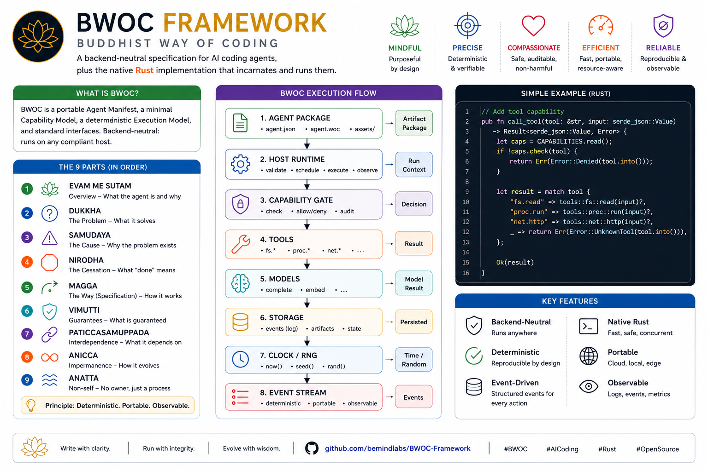
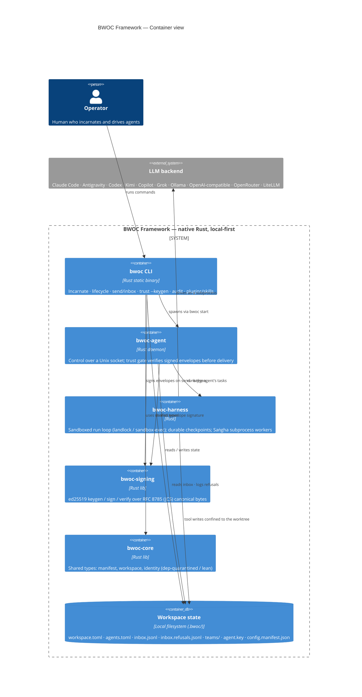

# BWOC Framework — Buddhist Way of Coding

A framework for building AI coding agents grounded in Buddhist philosophy as an engineering discipline.

[](https://github.com/bemindlabs/BWOC-Framework/stargazers)
[](LICENSE)
[](https://www.rust-lang.org/)
[](#tech-stack)
[](modules/agent-template/docs/)
[](#status)
[](CONTRIBUTING.md)

Buddhist principles are used here as **engineering thinking aids** — not religious interpretation. Pali terms are section names; the content is technical.

> GitHub: [github.com/bemindlabs/BWOC-Framework](https://github.com/bemindlabs/BWOC-Framework) · Conceptual core: [`PHILOSOPHY.en.md`](modules/agent-template/docs/en/PHILOSOPHY.en.md) · Vision: [`VISION.md`](VISION.md) · Contributing: [`CONTRIBUTING.md`](CONTRIBUTING.md)



---

## Contents

- [BWOC Framework — Buddhist Way of Coding](#bwoc-framework--buddhist-way-of-coding)
  - [Contents](#contents)
  - [What It Is](#what-it-is)
  - [Why Buddhist Frameworks](#why-buddhist-frameworks)
  - [The 22 Frameworks](#the-22-frameworks)
    - [A — Process](#a--process)
    - [B — State](#b--state)
    - [C — Growth](#c--growth)
    - [D — Relational](#d--relational)
    - [E — Discipline](#e--discipline)
    - [F — Governance](#f--governance)
  - [Stack Diagram](#stack-diagram)
  - [Five Principles to Know First](#five-principles-to-know-first)
    - [1. Yoniso Manasikāra — Verify Before Act](#1-yoniso-manasikāra--verify-before-act)
    - [2. Mattaññutā — Right Amount](#2-mattaññutā--right-amount)
    - [3. Anattā — Non-Clinging](#3-anattā--non-clinging)
    - [4. Samānattatā — Equal Treatment](#4-samānattatā--equal-treatment)
    - [5. Sīla-sāmaññatā — Communal Convention](#5-sīla-sāmaññatā--communal-convention)
  - [Crates \& Companion Apps](#crates--companion-apps)
  - [Repository \& Workspace Layout](#repository--workspace-layout)
    - [A. The BWOC framework repository](#a-the-bwoc-framework-repository)
    - [B. A user workspace (what `bwoc init` creates)](#b-a-user-workspace-what-bwoc-init-creates)
  - [Architecture (C4 Container View)](#architecture-c4-container-view)
  - [Environment Variables](#environment-variables)
  - [Infrastructure \& Datastores](#infrastructure--datastores)
  - [Getting Started](#getting-started)
    - [Install the toolkit](#install-the-toolkit)
    - [Quick start: `bwoc` in any repo](#quick-start-bwoc-in-any-repo)
    - [As an Agent Author](#as-an-agent-author)
    - [Reading Paths](#reading-paths)
  - [Security Rules (Sīla 5)](#security-rules-sīla-5)
  - [FAQ](#faq)
  - [Tech Stack](#tech-stack)
  - [Status](#status)
  - [Contributing](#contributing)
  - [Security](#security)
  - [Code of Conduct](#code-of-conduct)
  - [License](#license)

---

## What It Is

BWOC provides a **template and doctrine** for creating AI coding agents with a consistent, principled foundation:

- **One repo, one agent** — each agent lives in its own repository cloned from the template
- **Backend-neutral** — one `AGENTS.md` runs on ten declared backends: Claude, Antigravity, Codex, Kimi, Copilot, Grok, or self-hosted / hosted models via `bwoc-harness` (Ollama, any OpenAI-compatible endpoint, OpenRouter, LiteLLM)
- **Persistent memory** — accumulates knowledge across sessions with impermanence-aware pruning
- **Multi-agent safe** — multiple agents co-operate in the same repo without collision

---

## Why Buddhist Frameworks

Buddhist thinking addresses areas where Western engineering frameworks (DDD, Clean Architecture, SOLID) are thin: **state impermanence, failure tracing, lifecycle, inter-agent trust, and threat modeling**.

| Engineering Problem     | Buddhist Framework                                  |
| ----------------------- | --------------------------------------------------- |
| Problem solving         | Ariyasacca 4 (Four Noble Truths)                    |
| Functional requirements | Magga 8 (Noble Eightfold Path)                      |
| System architecture     | Khandha 5 (Five Aggregates)                         |
| State & impermanence    | Tilakkhaṇa (Three Marks)                            |
| Failure analysis        | Paṭiccasamuppāda (Dependent Origination)            |
| Audit logging           | Kamma 3 (Three Doors of Action)                     |
| Observability           | Satipaṭṭhāna 4 (Four Foundations)                   |
| Agent lifecycle         | Bhāvanā 4 (Four Cultivations)                       |
| Self-improvement        | Paññā 3 (Three Roots of Wisdom)                     |
| Capability maturity     | Ariya-dhana 7 (Seven Noble Treasures)               |
| Error UX                | Brahmavihāra 4 (Four Divine Abidings)               |
| Inter-agent trust       | Kalyāṇamitta 7 (Seven Qualities of a Good Friend)   |
| Threat modeling         | Taṇhā 3 (Three Cravings)                            |
| Baseline security       | Sīla 5 (Five Precepts)                              |
| Fleet governance        | Aparihāniya-dhamma 7 (Seven Non-Decline Principles) |

---

## The 22 Frameworks

Organized into six groups — see [`PHILOSOPHY.en.md`](modules/agent-template/docs/en/PHILOSOPHY.en.md) for full mappings.

### A — Process

Ariyasacca 4 · Magga 8 · Khandha 5

### B — State

Tilakkhaṇa · Paṭiccasamuppāda · Kamma 3

### C — Growth

Iddhipāda 4 · Bhāvanā 4 · Paññā 3 · Ariya-dhana 7

### D — Relational

Sappurisadhamma 7 · Saṅgahavatthu 4 · Sāraṇīyadhamma 6 · Brahmavihāra 4 · Kalyāṇamitta 7

### E — Discipline

Yoniso Manasikāra · Acinteyya 4 · Satipaṭṭhāna 4 · Padhāna 4

### F — Governance

Aparihāniya-dhamma 7 · Taṇhā 3 · Sīla 5

---

## Stack Diagram

```
┌──────────────────────────────────────────────────────┐
│  Aparihāniya-dhamma (Fleet Governance)               │ ← Org level
├──────────────────────────────────────────────────────┤
│  Taṇhā 3 (Threat Model) + Sīla 5 (Baseline)          │ ← Security
├──────────────────────────────────────────────────────┤
│  Bhāvanā 4 (Lifecycle) + Paññā 3 (Improvement)       │ ← Agent growth
├──────────────────────────────────────────────────────┤
│  Sāraṇīyadhamma + Kalyāṇamitta (Inter-agent)         │ ← Interconnect
├──────────────────────────────────────────────────────┤
│  Saṅgahavatthu + Brahmavihāra (UX)                   │ ← User layer
├──────────────────────────────────────────────────────┤
│  Magga 8 (Functional requirements)                   │ ← SRS
├──────────────────────────────────────────────────────┤
│  Khandha 5 (Architecture)                            │ ← Components
├──────────────────────────────────────────────────────┤
│  Satipaṭṭhāna 4 (Observability)                      │ ← Cross-cutting
├──────────────────────────────────────────────────────┤
│  Iddhipāda 4 (Engine of work)                        │ ← Runtime
├──────────────────────────────────────────────────────┤
│  Tilakkhaṇa + Kamma 3 (State & Audit)                │ ← Foundation
├──────────────────────────────────────────────────────┤
│  Paṭiccasamuppāda (Failure analysis)                 │ ← When broken
├──────────────────────────────────────────────────────┤
│  Yoniso manasikāra + Acinteyya (Method)              │ ← Thinking
└──────────────────────────────────────────────────────┘
       Ariyasacca 4 (Problem-solving cycle, end-to-end)
       Sappurisadhamma 7 (Context sensing, end-to-end)
```

---

## Five Principles to Know First

### 1. Yoniso Manasikāra — Verify Before Act

Memory is a past claim. Verify against present state before acting on it.

### 2. Mattaññutā — Right Amount

`MEMORY.md` ≤ 200 lines. Forces selection of what actually matters.

### 3. Anattā — Non-Clinging

Task done → cleanup worktree → delete branch. No attachment to past state.

### 4. Samānattatā — Equal Treatment

All backends receive equal treatment. No vendor favoritism in tooling.

### 5. Sīla-sāmaññatā — Communal Convention

All agents run under the same rules via `conventions.md` and a neutrality check.

---

## Crates & Companion Apps

The framework is a Rust workspace of focused crates, plus companion apps that build on the same protocols.

### Crates (this workspace)

| Crate | Kind | What it does |
| --- | --- | --- |
| [`bwoc-core`](crates/bwoc-core) | lib | Shared types — manifest, workspace/agent registry, schema versioning, lifecycle, trust labeling, `chat_proto`, idempotency ledger, loop control, env-scrub, sibling-binary resolution. **Lean + dep-quarantined**: every crate except `bwoc-signing` and `bwoc-deep-memory` depends on it, so it in turn depends on almost nothing (`serde`, `serde_json`, `toml`, `thiserror`). |
| [`bwoc-cli`](crates/bwoc-cli) | bin `bwoc` | The operator CLI — `init` · `new` · `list` · `spawn` · `chat` (`--tui`) · `run` · `start`/`stop`/`supervise` · `dashboard` · `loop` · `monitor` · `digest` · `check` · `migrate` · `audit` · `send` · `task` · `team`. |
| [`bwoc-agent`](crates/bwoc-agent) | bin `bwoc-agent` | The per-agent daemon (`--serve`) — Unix control socket (PING/STATUS/STOP), inbox polling + auto-process, and Saṅgha task-watch. |
| [`bwoc-harness`](crates/bwoc-harness) | bin + lib | The self-hosted agentic run loop for the `ollama` / `openai-compatible` / `openrouter` / `litellm` backends — tool set, capability gate → guardrails → permission → sandbox pipeline (with `--unrestricted` to lift the workdir path sandbox), OpenTelemetry, Saṅgha lead/worker (`--lead --loop`), checkpoint/resume, MCP client, and the interactive `--chat` session (streaming, persistent memory, live permission modes). |
| [`bwoc-tui`](crates/bwoc-tui) | lib | The ratatui chat client behind `bwoc chat --tui`, plus the multi-agent fleet view (`--fleet`) — renders the `chat_proto` stream from `bwoc-harness --chat`. |
| [`bwoc-loop-tui`](crates/bwoc-loop-tui) | lib | The `bwoc loop` control center — watch a team's task list drive toward Definition-of-Done, start/stop the goal-loop, and edit tasks · ticker · budget · plan approvals in place. |
| [`bwoc-signing`](crates/bwoc-signing) | lib | ed25519 signing primitives for the trust layer. |
| [`bwoc-a2a`](crates/bwoc-a2a) | bin + lib | Agent-to-agent transport (A2A protocol) — signed envelopes, agent cards, JSON-RPC serve/client, cross-workspace identity. |
| [`bwoc-connect`](crates/bwoc-connect) | bin + lib | Chat connectors bridging external platforms into an agent's inbox. Dependency-heavy by design, so it stays out-of-process — [`bwoc-agent`](crates/bwoc-agent) supervises it as a subprocess. |
| [`bwoc-mqtt`](crates/bwoc-mqtt) | bin + lib | MQTT transport for inter-workspace routing — publish an envelope to a broker, or `serve` (subscribe → deliver into `inbox.jsonl`). |
| [`bwoc-deep-memory`](crates/bwoc-deep-memory) | bin + lib | Tier-2 deep memory — mine past sessions into durable recall, searchable from an agent's turn. Deliberately out-of-process: it talks over a CLI contract and does **not** depend on `bwoc-core`. |

### Companion apps (separate repos)

| Project | What it is |
| --- | --- |
| **bwoc-chat** | Native desktop chat for BWOC agents — one agent or a **team** (N agents, one window). An egui frontend over `bwoc-harness --chat` (the `chat_proto` stream): streaming replies, markdown, a per-agent tool-activity pane, inline permission prompts, live `/mode`, `@` agent/file completion, and session memory. |
| **bwoc-penlee-sc01-plus** | SC01 Plus hardware fleet display — firmware (BLE config + WebSocket data) plus a Tauri host app. |

---

## Repository & Workspace Layout

Two distinct trees the project deals with: **(A)** this repository — what a contributor clones; and **(B)** a _user workspace_ — what `bwoc init` creates on a user's machine. They are not the same thing.

### A. The BWOC framework repository

```
bwoc-framework/
├── crates/                      ← Rust workspace (the reference implementation)
│   ├── bwoc-core/                 • shared types — manifest, workspace, schema, trust, chat_proto (lean, dep-quarantined)
│   ├── bwoc-cli/                  • `bwoc` binary — install · workspace · lifecycle · migrate · chat · audit
│   ├── bwoc-agent/                • `bwoc-agent` daemon — control socket · inbox · task watch
│   ├── bwoc-harness/              • self-hosted run loop — tools, guardrails, sandbox, OTel, Saṅgha, `--chat`
│   ├── bwoc-tui/                  • ratatui chat client behind `bwoc chat --tui`
│   ├── bwoc-loop-tui/             • `bwoc loop` control center
│   ├── bwoc-signing/              • ed25519 signing primitives
│   ├── bwoc-a2a/                  • agent-to-agent — signed envelopes + cross-workspace identity
│   ├── bwoc-mqtt/                 • MQTT inter-workspace transport
│   ├── bwoc-connect/              • chat connectors — Telegram · Discord · LINE · iMessage
│   └── bwoc-deep-memory/          • Tier-2 semantic recall (out-of-process)
├── modules/
│   ├── plugins/ · skills/       ← framework plugins + skills (see modules/README.md)
│   └── agent-template/          ← Core template (cloned per agent — see B)
│       ├── AGENTS.md              • single source of truth (backend entry files symlink to it — see neutrality.md)
│       ├── docs/{en,th}/          • PHILOSOPHY · PRD · SRS · SELF-IMPROVEMENT · THREAT-MODEL · OVERVIEW
│       └── persona/ · mindsets/ · skills/ · interconnect/ · memories/
├── docs/{en,th}/                ← Framework-level docs (bilingual pair)
│                                    ARCHITECTURE · COMPATIBILITY · MIGRATION · INCARNATION · WORKSPACE · NAMING · GLOSSARY · ROADMAP · FAQ
├── examples/                    ← howto · showcases · usecases (illustrative)
├── Formula/                     ← Homebrew formula (tap)
├── scripts/                     ← install.sh · bump-version.sh
├── notes/                       ← Development logs — YYYY-MM-DD_<title>.md
├── .github/                     ← CI (ci.yml, docs.yml) · issue + PR templates
├── Cargo.toml · Cargo.lock      ← Cargo workspace root
└── README · VISION · VERSION · CHANGELOG · CONTRIBUTING · SECURITY · CODE_OF_CONDUCT · LICENSE · CLAUDE.md
```

### B. A user workspace (what `bwoc init` creates)

The CLI operates against a **workspace** the user designates — independent of any git repository. Full spec in [`docs/en/WORKSPACE.en.md`](docs/en/WORKSPACE.en.md) (Thai: [`docs/th/WORKSPACE.th.md`](docs/th/WORKSPACE.th.md)).

```
<workspace>/                    ← any directory the user picks
├── .bwoc/                        • workspace marker (REQUIRED)
│   ├── workspace.toml              · name, version, defaults (backend, lang)
│   ├── agents.toml                 · auto-maintained agent index
│   └── memory/                     · workspace-scoped memory (OPTIONAL)
├── agents/                       • incarnated agents live here (RECOMMENDED)
│   ├── alpha/                      · one BWOC agent — clone of `modules/agent-template/`
│   └── beta/
└── ...                           • user's other files coexist freely

~/.bwoc/                        ← central per-user memory (independent of workspace)
├── config.toml                   • user defaults — backend, lang, default workspace
├── memory/                       • shared by every agent this user runs
├── workspaces.toml               • known-workspaces registry
└── logs/                         • CLI invocation logs
```

**Workspace resolution** (first match wins): `--workspace <path>` flag → `BWOC_WORKSPACE` env → nearest ancestor with `.bwoc/` → cwd if it has `.bwoc/` → fail with exit code 2 + `bwoc init` hint.

---

## Architecture (C4 Container View)

A [C4](https://c4model.com/) container view of the reference implementation —
the native Rust binaries + libraries, the local filesystem state, and the
external LLM backend. The core is local-first — no database server or container
runtime; network surfaces are opt-in (see [Infrastructure & Datastores](#infrastructure--datastores)).


```mermaid
C4Container
    title BWOC Framework — Container view

    Person(operator, "Operator", "Human who incarnates and drives agents")
    System_Ext(llm, "LLM backend", "Claude Code · Antigravity · Codex · Kimi · Copilot · Grok · Ollama · OpenAI-compatible · OpenRouter · LiteLLM")

    System_Boundary(bwoc, "BWOC Framework — native Rust, local-first") {
        Container(cli, "bwoc CLI", "Rust static binary", "Incarnate · lifecycle · send/inbox · trust --keygen · audit · plugins/skills")
        Container(agent, "bwoc-agent", "Rust daemon", "Control over a Unix socket; trust gate verifies signed envelopes before delivery")
        Container(harness, "bwoc-harness", "Rust", "Sandboxed run loop (landlock / sandbox-exec); durable checkpoints; Saṅgha subprocess workers")
        Container(signing, "bwoc-signing", "Rust lib", "ed25519 keygen / sign / verify over RFC 8785 (JCS) canonical bytes")
        Container(core, "bwoc-core", "Rust lib", "Shared types: manifest, workspace, identity (dep-quarantined / lean)")
        ContainerDb(fs, "Workspace state", "Local filesystem (.bwoc/)", "workspace.toml · agents.toml · inbox.jsonl · inbox.refusals.jsonl · teams/ · agent.key · config.manifest.json")
    }

    Rel(operator, cli, "runs commands")
    Rel(cli, fs, "reads / writes state")
    Rel(cli, signing, "signs envelopes on send · keygen")
    Rel(cli, core, "uses shared types")
    Rel(cli, agent, "spawns via bwoc start")
    Rel(agent, fs, "reads inbox · logs refusals")
    Rel(agent, signing, "verifies envelope signature")
    Rel(agent, harness, "runs the agent's tasks")
    Rel(harness, llm, "drives as a subprocess")
    Rel(harness, fs, "tool writes confined to the worktree")
```

Inter-agent messages are **signed envelopes** appended to the recipient's
`inbox.jsonl`; the daemon's trust gate verifies the sender's signature (and the
Kalyāṇamitta-7 quality check) before delivery, logging rejects to
`inbox.refusals.jsonl`. See [`SIGNING.en.md`](docs/en/SIGNING.en.md).

---

## Environment Variables

The `bwoc` CLI and `bwoc-agent` daemon read and respect the following environment variables:

| Variable | Purpose | Supported Values |
| :--- | :--- | :--- |
| `BWOC_WORKSPACE` | Overrides the workspace path. Part of the resolution chain: explicit `--workspace` → `BWOC_WORKSPACE` → ancestor walk. | Absolute or relative directory path |
| `BWOC_LANG` | Sets the CLI and daemon UI language. Precedence: `--lang` flag → `BWOC_LANG` → `$LANG` → default `en`. | `en` (English), `th` (Thai) |
| `BWOC_TEMPLATE` | Sets the custom path to an agent template for incarnation via `bwoc new`. | Directory path containing `agent-template` |
| `BWOC_TRUST_GATING` | Kalyāṇamitta-7 quality gate at the daemon. On by default in **warn-only** mode (logs senders missing `requiredTrust` instead of refusing them; signature, replay and unresolvable-sender refusals are unchanged); `1` enforces the manifest `trust.mode`, including refusal. | unset or empty = warn (default), `1` = enforce, `0`/`off`/`false` = disabled |
| `BWOC_TASK_POLL_SECS` | How often `bwoc-agent --serve` re-scans team task lists for newly-claimable work. Raise it for a large fleet (fewer file reads), lower it for snappier pickup. | Integer seconds; default `2`, floored at `1` |
| `BWOC_TASK_WAKEUP` | Opt-in flag for `bwoc-agent --serve` to ping the agent's tmux session when a new claimable task is available. | `1` to enable, otherwise disabled |
| `BWOC_AUTO_CLAIM` | Opt-in flag for `bwoc-agent --serve` to automatically claim and wake up the agent when a new task becomes claimable. | `1` to enable, otherwise disabled |
| `BWOC_WARM` | Opt-in flag for `bwoc-agent --serve` to run an auto-claimed task in a resident `bwoc-harness --headless` (warm — no per-task cold-start) instead of tmux-waking a session. Confined (harness) backends only; `requires_plan` tasks fall back to the wake path. | `1` to enable, otherwise disabled |
| `BWOC_DISABLE_TMUX_WAKEUP` | Opt-out flag to suppress tmux wakeup pings during `bwoc send` (useful in CI or testing). | `1` to suppress |
| `BWOC_NO_DEPRECATION_WARNINGS` | Suppresses the one-line stderr warning printed when a deprecated CLI command is used (e.g. `bwoc notes` → `bwoc doc`). stdout, `--json` and exit codes are never affected. | `1` to suppress |
| `BWOC_NO_WHATSNEW` | Suppresses the one-line "you upgraded" notice printed to stderr on the first run of a new `MAJOR.MINOR` version. | `1` to suppress |
| `BWOC_NO_UPDATE_CHECK` | Opts out of the startup update-check (the network drift guard that compares the running version against the latest release). | Set to any value to opt out |

---

## Infrastructure & Datastores

BWOC is designed to be extremely lightweight, localized, and resilient. To clarify system architecture:
- **Native binaries, no runtime:** single static Rust binaries — no Node.js, JVM, Docker, or VM needed to incarnate or run agents. `bwoc-harness` sandboxes natively (Landlock + seccomp on Linux, `sandbox-exec` on macOS).
- **Local-first state:** the core keeps state as plain files — `.bwoc/workspace.toml`, `.bwoc/agents.toml`, `.bwoc/inbox.jsonl`, `.bwoc/inbox.refusals.jsonl`, `.bwoc/teams/` — and the daemon talks over a Unix domain socket (`.bwoc/agent.sock`) or a Windows named pipe. No database server.
- **Opt-in network and storage surfaces, out of process:** `bwoc a2a serve` (loopback by default), `bwoc-mqtt`, `bwoc-connect` chat connectors, and `bwoc-deep-memory` (embedded SQLite) are separate binaries you enable explicitly.

---

## Getting Started

### Install the toolkit

**Homebrew** (macOS + Linux — pre-built binaries, no Rust toolchain needed):

```bash
brew tap bemindlabs/bwoc https://github.com/bemindlabs/BWOC-Framework
brew trust bemindlabs/bwoc   # Homebrew 6.x+ refuses formulae from untrusted third-party taps
brew install bwoc
```

Installs all three binaries (`bwoc`, `bwoc-agent`, `bwoc-harness`) and covers macOS Apple Silicon, macOS Intel, Linux aarch64, and Linux x86_64. Windows users: grab the `.zip` from [GitHub Releases](https://github.com/bemindlabs/BWOC-Framework/releases/latest) directly. Each release tag refreshes the formula's SHA256s.

> [!note]
> `brew trust` is needed from **Homebrew 6.x** onward, which refuses third-party formulae by default (`Refusing to load formula … from untrusted tap`). Older Homebrew has no such subcommand — skip that line if `brew --version` reports 5.x or earlier.

**From source** (one command, requires a [Rust toolchain](https://rustup.rs/) on PATH):

```bash
./scripts/install.sh
```

Installs all three binaries (`bwoc` CLI + `bwoc-agent` daemon + `bwoc-harness` agentic loop) to `~/.cargo/bin/`. The script warns up front if `~/.cargo/bin` isn't on PATH.

**CLI-only** (skips the daemon that `bwoc start` spawns as `bwoc-agent --serve`, and the harness behind `bwoc chat --tui` / `bwoc eval` / `--headless`):

```bash
cargo install --path crates/bwoc-cli --locked --force
```

**Upgrading from 2.x:** 3.x reads everything 2.x wrote and warns on legacy schema; run `bwoc migrate` to move an installation forward. See [`COMPATIBILITY.en.md`](docs/en/COMPATIBILITY.en.md) and [`MIGRATION.en.md`](docs/en/MIGRATION.en.md).

### Quick start: `bwoc` in any repo

```bash
cd any-repo
bwoc auth set anthropic   # or export ANTHROPIC_API_KEY=..., or just run Ollama locally
bwoc                      # a coding session right here: no workspace, no agent
```

On a terminal, bare `bwoc` opens the chat TUI on `bwoc-harness` in the current directory. The session's prompt holds a built-in coding preamble, the environment (cwd, OS, date, git state) and every `AGENTS.md` / `CLAUDE.md` from the git root down to the cwd. Pin the provider with `--backend` / `--model`, with `BWOC_BACKEND` / `BWOC_MODEL`, or with a `[runtime]` table in `.bwoc/config.toml` or `~/.bwoc/config.toml`. Otherwise an Anthropic key is used, then a local Ollama. On a Claude Code, Codex, Antigravity, Kimi, Copilot or Grok subscription, `bwoc --backend claude` (or `codex`, `agy`, `kimi`, `copilot`, `grok`) hands the session to that CLI on its own login, with no API key. In a pipe or script, bare `bwoc` still prints the banner, and `bwoc about` shows it on a terminal. Details: [`HARNESS.en.md` §Quick start](docs/en/HARNESS.en.md#quick-start-bwoc-in-any-repository).

### As an Agent Author

```bash
mkdir my-workspace && cd my-workspace
bwoc init                 # creates .bwoc/workspace.toml + agents/ + scaffold dirs
bwoc new alpha            # interactive: pickers for backend, role, primary model;
                          # stack-detected defaults for lint/format/test/build
bwoc start alpha          # flip status active + spawn bwoc-agent --serve
bwoc list                 # ●/○ liveness + STATUS + BACKEND + INBOX + PATH
bwoc status alpha         # detail + runtime: ● running (pid N, uptime Xs)
```

Press Enter through the `bwoc new` prompts to accept all suggested defaults — every required field has a picker or a stack-aware default.

```bash
# Send a message; tail the inbox in another terminal
bwoc send alpha "please refactor src/lib.rs"
bwoc inbox alpha --watch     # blocks; new messages appear live

# When done
bwoc stop alpha              # signals daemon STOP + flips registry
bwoc retire alpha            # removes from registry (+ optional file delete)
```

Run `bwoc help` for the topic index. Ten guides ship in-binary: `getting-started`, `backends`, `workspace`, `manifest`, `arc`, `lifecycle`, `daemon`, `messaging`, `persona`, `memory`. Run `bwoc help <topic>` for any specific one.

**Target: from clone to first configured commit in under 30 minutes.**

Full walkthrough — including placeholder resolution, persona definition, multilingual setup, and the verification checklist — is in [`docs/en/INCARNATION.en.md`](docs/en/INCARNATION.en.md) (Thai: [`docs/th/INCARNATION.th.md`](docs/th/INCARNATION.th.md)).

### Reading Paths

**30 min** — `OVERVIEW.en.md` → workflow examples

**2 hours** — `OVERVIEW` → `PHILOSOPHY` (groups A–F) → `PRD` → `SRS`

**Full depth** — read every file in `docs/` in order

---

## Security Rules (Sīla 5)

These are non-negotiable baseline rules derived directly from the Five Precepts:

- No `rm -rf` of repo root
- No committing secrets
- No spoofing agent identity
- No bypassing verification gates
- No undeclared side-effects

---

## FAQ

The three most-asked questions in summary; full FAQ in [`docs/en/FAQ.en.md`](docs/en/FAQ.en.md) (Thai: [`docs/th/FAQ.th.md`](docs/th/FAQ.th.md)).

**Do I need to know Buddhism?**
No. Pali terms are labels; content is purely technical.

**Does this conflict with DDD / Clean Architecture / SOLID?**
No. BWOC extends them into areas they don't cover: state impermanence, failure tracing, inter-agent trust.

**Can I use this without the Buddhist framing?**
Yes — keep the technical skeleton. You lose the unified "why" behind design decisions.

---

## Tech Stack

BWOC is specification-first. The reference implementation is a native, cross-platform Rust toolchain.

| Surface                                                 | Stack                                                                                                                  | Platforms                                                 |
| ------------------------------------------------------- | ---------------------------------------------------------------------------------------------------------------------- | --------------------------------------------------------- |
| Specification                                           | Markdown (two-tier: plain for `AGENTS.md`, Obsidian-flavored elsewhere)                                                | —                                                         |
| `bwoc` CLI                                              | Rust, single static binary                                                                                             | **macOS · Linux · Windows**                               |
| `bwoc-agent` runtime (ships with each incarnated agent) | Rust, single static binary                                                                                             | **macOS · Linux · Windows**                               |
| CLI i18n (output strings)                               | Project Fluent (`.ftl` per locale)                                                                                     | **Ships with TH · EN**; pluggable for any future language |
| Backend integration | Ten declared backends: vendor CLIs as subprocesses (`claude`, `agy`, `codex`, `kimi`, `copilot`, `grok`) or `bwoc-harness` for `ollama` / `openai-compatible` / `openrouter` / `litellm` | Whatever the backend supports |
| Distribution | GitHub Release binaries with SHA-256 checksums · Homebrew tap · `cargo install` from source | — |
| License                                                 | MIT (see [`LICENSE`](LICENSE))                                                                                         | —                                                         |

The CLI has zero runtime dependencies beyond `libc` / `Win32`. No JVM, no Node, no Docker required to incarnate or run an agent.

---

## Status

**Current phase:** Phase 7 — _anicca_ (versioned change & the compatibility contract) — **DoD met; 3.0 shipped** (`v2026.9.13-0`, patch `v2026.9.13-1`), followed by 3.1 onward inside its contract; no next phase is defined yet. Phase 7 delivered: every framework-owned artifact declares its schema, `bwoc migrate` moves an installation forward, specification 3.0 is validated, and `[plugin].compat` is enforced. Phase 6 — _paññā_ (harness eval & cross-platform hardening) DoD met; Phases 1–5 DoD met and signed off: Phase 1 end-to-end **uppāda** for one backend; Phase 2 _ṭhiti operations_; Phase 3 the cross-workspace interconnect mesh + Kalyāṇamitta-7 trust; Phase 4 fleet governance; Phase 5 _saṃvara_ trust-boundary & sandbox hardening. Per-phase detail is in [`docs/en/ROADMAP.en.md`](docs/en/ROADMAP.en.md).

**Latest release:** [`v2026.10.8-0`](https://github.com/bemindlabs/BWOC-Framework/releases/tag/v2026.10.8-0) (3.14.0) — **see who is waiting on you**: opt-in [herdr](https://herdr.dev) support — `bwoc sessions` reports `blocked` / `done` agents, and `bwoc fleet term --backend herdr` opens the fleet in herdr panes.

| Area | Status |
| --- | --- |
| Specification 3.0 (Philosophy, PRD, SRS, Threat) — validated by `bwoc check` | Ready |
| Compatibility contract — schema markers, `bwoc migrate`, enforced `[plugin].compat` | Ready — [`COMPATIBILITY.en.md`](docs/en/COMPATIBILITY.en.md) |
| `bwoc` CLI + `bwoc-agent` daemon (macOS · Linux · Windows, CI matrix) | Ready |
| Kalyāṇamitta-7 trust + signed envelopes | Ready (daemon warns by default; refusal behind `BWOC_TRUST_GATING=1`) |
| `bwoc-harness` self-hosted runtime (`--chat`, sandbox, eval) | Ready |
| Interconnect (A2A, MQTT) + chat connectors | Ready |
| Fleet dashboard (`bwoc dashboard`) | Deprecated in 3.4 → `bwoc fleet` / `bwoc chat <agent> --tui --fleet`; removed in 4.0 |
| Loop engineering (goal + ticker + gate) | **L1 ✓** · **L2 partial** (`Cron`/`Adaptive` deferred) · **L3 ✓** — see [`LOOP-ENGINEERING.en.md`](docs/en/LOOP-ENGINEERING.en.md) |

For the full phase-by-phase plan with completed / in-progress / remaining items, see [`docs/en/ROADMAP.en.md`](docs/en/ROADMAP.en.md) (Thai: [`docs/th/ROADMAP.th.md`](docs/th/ROADMAP.th.md)).

---

## Contributing

We welcome contributions. See [`CONTRIBUTING.md`](CONTRIBUTING.md) for the workflow, commit style, and PR checklist. New to the project? Start with [`VISION.md`](VISION.md), then [`PHILOSOPHY.en.md`](modules/agent-template/docs/en/PHILOSOPHY.en.md).

## Security

Found a vulnerability? **Do not open a public issue.** Email **info@bemind.tech** as described in [`SECURITY.md`](SECURITY.md). The full threat model lives in [`THREAT-MODEL.en.md`](modules/agent-template/docs/en/THREAT-MODEL.en.md).

## Code of Conduct

This project follows a [`CODE_OF_CONDUCT.md`](CODE_OF_CONDUCT.md) grounded in Sīla 5 (prohibited conduct) and Brahmavihāra 4 (expected disposition). Pali terms are section names; content is technical and non-sectarian.

## License

[MIT](LICENSE) — see the full license text.
